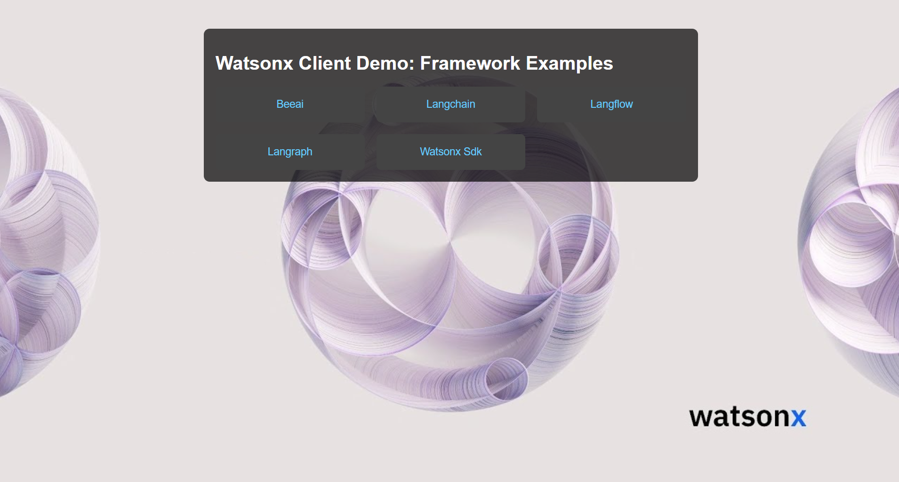
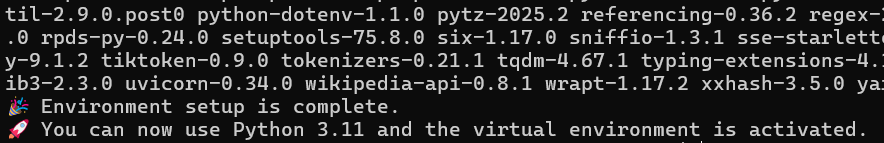
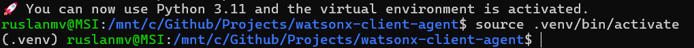
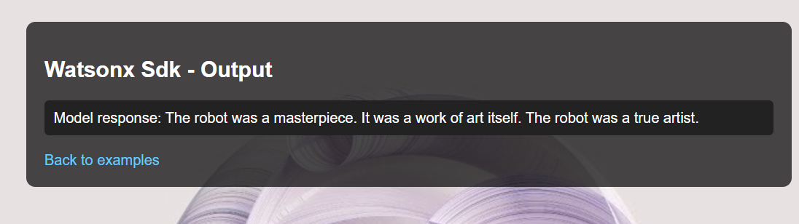
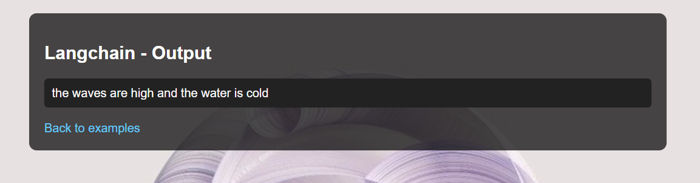
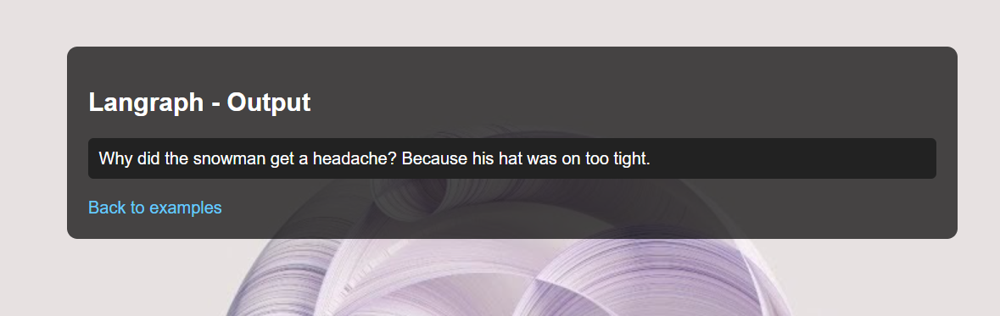

# Watsonx Client in Python Across Frameworks

**Source of Watsonx Models:**  
[https://dataplatform.cloud.ibm.com/docs/content/wsj/analyze-data/fm-models.html?context=wx](https://dataplatform.cloud.ibm.com/docs/content/wsj/analyze-data/fm-models.html?context=wx)

This repository demonstrates how to load and use Watsonx foundation models in Python using several popular frameworks. The integration examples include:

- **`ibm_watsonx_ai` (Official SDK):**  
  Use this when you want direct, low-level access to Watsonx AI endpoints. This is ideal for custom applications where you need full control over API interactions.

- **Langchain:**  
  Langchain provides a high-level, composable interface for large language models. It is a good choice when you want to quickly build applications that integrate multiple models and chain them together.

- **Langraph:**  
  Langraph builds on Langchain by allowing you to define workflows as graphs. Use this when you need stateful multi-step processes or want to visualize the chain of operations.

- **Langflow Integration:**  
  Langflow offers a visual interface to design and configure flows. It’s perfect for users who prefer drag-and-drop UI configuration, yet still want to leverage the power of Watsonx models.

- **bee-ai Framework:**  
  BeeAI is focused on production-ready multi-agent systems. This framework provides the tools for building autonomous agents and workflows. Use it when you need to combine multiple agents (such as for research, weather forecasting, and data synthesis) into a coherent workflow.

---

## Setup Environment
First you open your terminal and you go to your linux enviroment, we will use ubuntu 22.04
then clone this repo
```
git clone https://github.com/ruslanmv/watsonx-client-agent
```

then install the enviroment

```
bash install.sh
```




then you can load the environment 
```
source .venv/bin/activate
```

## Setting up your `.env` file

It's best practice to store sensitive information like API keys in a `.env` file. This prevents you from hardcoding them in your scripts.

1. **Install `python-dotenv`:**

    ```bash
    pip install python-dotenv
    ```

2. **Create a `.env` file** in the root directory of your project. Add your Watsonx credentials to it:

    ```env
    IBM_CLOUD_API_KEY="YOUR_API_KEY"
    IBM_CLOUD_URL="https://us-south.ml.cloud.ibm.com"  # Or your region's URL
    IBM_CLOUD_PROJECT_ID="YOUR_PROJECT_ID"             # Or space_id if using a space
    ```

    Replace the placeholder values with your actual IBM Cloud API key, URL, and Project ID (or Space ID).

---


## 1. `ibm_watsonx_ai` (Official SDK)

**File:** `examples/watsonx_sdk_example.py`

**When to use:**  
Use the official SDK when you require direct and granular control over Watsonx model API calls. This approach is best for applications that need to handle custom API parameters or for developers who want to work closely with IBM’s native interface.

**Installation:**

```bash
pip install ibm-watsonx-ai python-dotenv
```

**Code:**

```python
import os
from pathlib import Path
from dotenv import load_dotenv

from ibm_watsonx_ai import APIClient, Credentials
from ibm_watsonx_ai.foundation_models import ModelInference
from ibm_watsonx_ai.metanames import GenTextParamsMetaNames as GenParams

# Load .env
load_dotenv()

# Load environment variables
api_key = os.getenv("WATSONX_APIKEY")
url = os.getenv("WATSONX_URL")
project_id = os.getenv("PROJECT_ID")

# Check required vars
if not api_key:
    raise ValueError("WATSONX_APIKEY is missing or empty.")
if not url:
    raise ValueError("WATSONX_URL is missing or empty.")
if not project_id:
    raise ValueError("PROJECT_ID is missing or empty.")

# Set up credentials
credentials = Credentials(
    url=url,
    api_key=api_key
)

# Optional: create and reuse client
client = APIClient(credentials=credentials, project_id=project_id)

# Set model and prompt
model_id = "ibm/granite-13b-instruct-v2"
prompt = "Write a short story about a robot who wants to be a painter."

# Define parameters using MetaNames
parameters = {
    GenParams.DECODING_METHOD: "greedy",
    GenParams.MAX_NEW_TOKENS: 200,
}

# Initialize the inference model
model = ModelInference(
    model_id=model_id,
    credentials=credentials,
    project_id=project_id
)

# Run inference
response = model.generate_text(
    prompt=prompt,
    params=parameters
)

# Output
print("Model response:", response)

```

---

## 2. Langchain

**File:** `examples/langchain_example.py`

**When to use:**  
Langchain is a powerful framework for quickly building applications with LLMs. It abstracts many of the low-level details, allowing you to focus on designing prompt templates and chaining model calls. Use this when you need a flexible, high-level API for building complex language applications.

**Installation:**

```bash
pip install langchain ibm-watsonx-ai python-dotenv
```

**Code:**

```python
import os
from dotenv import load_dotenv
from langchain_ibm import WatsonxLLM  # Ensure langchain-ibm is installed

# Load environment variables from .env file
load_dotenv()

# Retrieve credentials from environment variables.
url = os.getenv("WATSONX_URL")
project_id = os.getenv("PROJECT_ID")
api_key = os.getenv("WATSONX_API_KEY")
# Note: The API key should be set in your environment variable 'WATSONX_APIKEY'

# Specify the model ID.
model_id = "ibm/granite-13b-instruct-v2"

# Define the model parameters.
parameters = {
    "decoding_method": "sample",   # or "greedy" if preferred
    "max_new_tokens": 200,
    "min_new_tokens": 1,
    "temperature": 0.5,
    "top_k": 50,
    "top_p": 1,
}

# Initialize the WatsonxLLM instance.
watsonx_llm = WatsonxLLM(
    model_id=model_id,
    url=url,
    project_id=project_id,
    params=parameters,
    apikey=api_key,  # Explicitly pass the API key
)

# Example of generating text.
prompt = "Write a short poem about the ocean."
response = watsonx_llm.invoke(prompt)

print(response)

```

---

## 3. Langraph

**File:** `examples/langraph_example.py`

**When to use:**  
Langraph is ideal when you need to manage state and define workflows as graphs. It lets you create multi-step processes where the output of one model invocation can feed into the next. This is especially useful in applications where context or state across multiple interactions is important.

**Installation:**

```bash
pip install langgraph langchain ibm-watsonx-ai python-dotenv
```

**Code:**

```python
import os
from dotenv import load_dotenv
from langchain_ibm import WatsonxLLM  # Import from langchain_ibm
from langgraph.graph import StateGraph, END
from langchain.schema import HumanMessage

# Load environment variables from .env file
load_dotenv()

# Load API credentials and project ID from environment variables
api_key = os.getenv("WATSONX_API_KEY")
url = os.getenv("WATSONX_URL")
project_id = os.getenv("PROJECT_ID")

# Specify the model ID
model_id = "ibm/granite-13b-instruct-v2"

# Initialize the WatsonxLLM with the correct parameter names
watsonx_llm = WatsonxLLM(
    model_id=model_id,
    url=url,
    apikey=api_key,
    project_id=project_id,
    params={
        "decoding_method": "greedy",
        "max_new_tokens": 200
    }
)

# Define a node in the graph that uses the Watsonx model
def generate_response(state):
    messages = state["messages"]
    response = watsonx_llm.invoke(messages)
    return {"messages": messages + [response]}

# Create a new graph and add the node
workflow = StateGraph(dict)
workflow.add_node("generate", generate_response)
workflow.set_entry_point("generate")
workflow.add_edge("generate", END)
app = workflow.compile()

# Example usage
inputs = {"messages": [HumanMessage(content="Tell me a joke.")]}

result = app.invoke(inputs)

# Print only the answer (assumed to be the last element in the messages list)
answer = result["messages"][-1]
print(answer)

```

---

## 4. Langflow Integration

**File:** `langflow/langflow.md`

**When to use:**  
Langflow offers a visual interface for designing and configuring flows. This approach is suited for users who prefer a GUI to build and tweak interactions without writing extensive code. Langflow is also useful for rapid prototyping.

**Content of `langflow/langflow.md`:**

```markdown
# Langflow Integration with Watsonx Models

**Installation:**

Follow the installation instructions for Langflow. Typically, you will clone the repository and install dependencies. Additionally, install:

```bash
pip install ibm-watsonx-ai langchain python-dotenv
```

**Configuring Langflow:**

1. **Start Langflow:** Run the Langflow application.
2. **Create a New Flow:** Click on "Create Flow" in the Langflow UI.
3. **Add a WatsonxLLM Component:** Search for the WatsonxLLM component in the components panel and drag it onto the canvas.
4. **Configure the Component:** In the WatsonxLLM component's properties, set the following:
    - **IBM Cloud URL:** Your Watsonx API endpoint.
    - **IBM Cloud API Key:** Your IBM Cloud API key.
    - **IBM Cloud Project ID (or Space ID):** The project or space identifier.
    - **Model ID:** For example, "ibm/granite-13b-instruct-v2".
    - **Optional model parameters:** Such as `decoding_method` (e.g., "greedy") and `max_new_tokens` (e.g., 200).
5. **Connect to Other Components:** Link the WatsonxLLM component with other components (e.g., Prompt Template, Output Parser) to build your workflow.
6. **Environment Variables:** Optionally, configure Langflow to load environment variables from a `.env` file if supported by your deployment.

**Running the Example Code:**

The repository includes an example Python script that simulates Langflow's integration with Watsonx models. To run this example from the root directory, follow these steps:

1. **Configure Your Environment:**  
   Ensure that your `.env` file (located at the root of the repository) is properly configured with your IBM Cloud credentials:
   ```env
   IBM_CLOUD_API_KEY="YOUR_API_KEY"
   IBM_CLOUD_URL="https://us-south.ml.cloud.ibm.com"  # Or your region's URL
   IBM_CLOUD_PROJECT_ID="YOUR_PROJECT_ID"             # Or space_id if using a space
   ```

2. **Run the Example Script:**  
   From the root directory of the repository, execute:
   ```bash
   python examples/langflow_example.py
   ```
   This script will:
   - Load your IBM Cloud credentials from the `.env` file.
   - Initialize the WatsonxLLM integration.
   - Simulate a prompt input (e.g., "Describe the future of artificial intelligence.").
   - Generate and print the response from the Watsonx model.


**File:** `examples/langflow_example.py`

```python
"""
langflow_example.py

This example simulates how to integrate Watsonx models with Langflow.
While Langflow is primarily configured through its visual interface, this
script demonstrates how you might invoke the Watsonx model backend using
the WatsonxLLM wrapper (defined in llms/watsonx.py) as if it were configured
within a Langflow flow.

Ensure that you have a valid .env file with your IBM Cloud credentials.
"""

import os
from dotenv import load_dotenv
from llms.watsonx import WatsonxLLM

def main():
    # Load environment variables from .env
    load_dotenv()
    
    # Initialize WatsonxLLM as configured for Langflow integration.
    # These parameters should match those set in the Langflow WatsonxLLM component.
    model_id = "ibm/granite-13b-instruct-v2"
    watsonx_llm = WatsonxLLM(
        model_id=model_id,
        decoding_method="greedy",
        max_new_tokens=200
    )
    
    # Simulate input from a Langflow flow.
    prompt = "Describe the future of artificial intelligence."
    
    # Invoke the Watsonx model and get the response.
    response = watsonx_llm.generate_text(prompt)
    
    print("Langflow simulated response:")
    print(response)

if __name__ == "__main__":
    main()
```

---

## 5. bee-ai Framework

**File:** `examples/beeai_example.py`

**When to use:**  
The BeeAI framework is designed for building production-ready multi-agent systems. It allows you to orchestrate complex workflows where different agents collaborate (e.g., one agent researching, another forecasting weather, and a third synthesizing data). This is ideal for enterprise applications where diverse functionalities need to be integrated into one coherent system.

**Installation:**

```bash
pip install ibm-watsonx-ai python-dotenv beeai-framework
```

**Code:**

```python
import asyncio
import sys
import traceback

from beeai_framework.backend.chat import ChatModel
from beeai_framework.backend.message import UserMessage
from beeai_framework.tools.search.wikipedia import WikipediaTool
from beeai_framework.tools.weather.openmeteo import OpenMeteoTool
from beeai_framework.workflows.agent import AgentWorkflow, AgentWorkflowInput
from beeai_framework.errors import FrameworkError

async def main() -> None:
    # Initialize the Watsonx LLM using the provider's model identifier.
    # Note: The response_format parameter is not accepted, so it has been removed.
    llm = ChatModel.from_name("watsonx:granite-13b-instruct-v2")

    # Create a multi-agent workflow named "Smart Assistant".
    workflow = AgentWorkflow(name="Smart Assistant")

    # Add a Researcher agent to look up and provide information about a topic.
    workflow.add_agent(
        name="Researcher",
        role="A diligent researcher.",
        instructions="You look up and provide information about a specific topic.",
        tools=[WikipediaTool()],
        llm=llm,
    )

    # Add a WeatherForecaster agent to provide detailed weather reports.
    workflow.add_agent(
        name="WeatherForecaster",
        role="A weather reporter.",
        instructions="You provide detailed weather reports.",
        tools=[OpenMeteoTool()],
        llm=llm,
    )

    # Add a DataSynthesizer agent to combine disparate information into a coherent summary.
    workflow.add_agent(
        name="DataSynthesizer",
        role="A meticulous and creative data synthesizer",
        instructions="You can combine disparate information into a final coherent summary.",
        llm=llm,
    )

    # Define a location to use as context.
    location = "Saint-Tropez"

    # Run the workflow with sequential inputs:
    # 1. Provide a short history of the location.
    # 2. Provide a comprehensive weather summary for the location today.
    # 3. Summarize both historical and weather data.
    response = await workflow.run(
        inputs=[
            AgentWorkflowInput(
                prompt=f"Provide a short history of {location}.",
            ),
            AgentWorkflowInput(
                prompt=f"Provide a comprehensive weather summary for {location} today.",
                expected_output="Essential weather details such as chance of rain, temperature and wind. Only report information that is available.",
            ),
            AgentWorkflowInput(
                prompt=f"Summarize the historical and weather data for {location}.",
                expected_output=f"A paragraph that describes the history of {location}, followed by the current weather conditions.",
            ),
        ]
    ).on(
        "success",
        lambda data, event: print(
            f"\n-> Step '{data.step}' has been completed with the following outcome.\n\n{data.state.final_answer}"
        ),
    )

    # Print the final answer from the workflow.
    print("==== Final Answer ====")
    print(response.result.final_answer)

if __name__ == "__main__":
    try:
        asyncio.run(main())
    except FrameworkError as e:
        traceback.print_exc()
        sys.exit(e.explain())

```

---

## Additional Files

- **.gitignore:** Lists files and directories that should be ignored by Git.
- **LICENSE:** Contains licensing information.
- **requirements.txt:** Lists all dependencies for the project.
- **check_models.py, embeddings/watsonx_embeddings.py, llms/watsonx.py:** Existing files to support model verification and integration.

---

## Project Structure

```
watsonx-client-agentic
├── .env
├── .gitignore
├── LICENSE
├── README.md
├── requirements.txt
├── check_models.py
├── embeddings
│   └── watsonx_embeddings.py
├── llms
│   └── watsonx.py
├── examples
│   ├── watsonx_sdk_example.py
│   ├── langchain_example.py
│   ├── langraph_example.py
│   ├── langflow_example.py
│   └── beeai_example.py
└── langflow
    └── langflow.md
```

---

## Updated `requirements.txt`

```txt
ibm-watsonx-ai>=1.0.0
langchain>=0.0.147
python-dotenv>=0.20.0
langgraph>=0.1.0
beeai-framework>=0.1.0
```

---

## Summary

This project serves as a generalized client agentic tool that lets you invoke Watsonx.ai models across several key frameworks. Each framework offers different benefits:

- **Official SDK (`ibm_watsonx_ai`):** For direct API access and full control.
- **Langchain:** For high-level, composable interactions with LLMs.
- **Langraph:** For creating stateful, multi-step workflows with a graph-based approach.
- **Langflow:** For a visual, drag-and-drop experience in designing model workflows.
- **bee-ai:** For building production-ready multi-agent systems that integrate various capabilities.

By following the examples and using the provided code, you can choose the best approach for your application and seamlessly integrate Watsonx models into your Python projects.

Happy coding!